# 🚀 React Project Setup Commands

### 🔹 1. `npm init`
👉 Creates a **Node.js project**.  
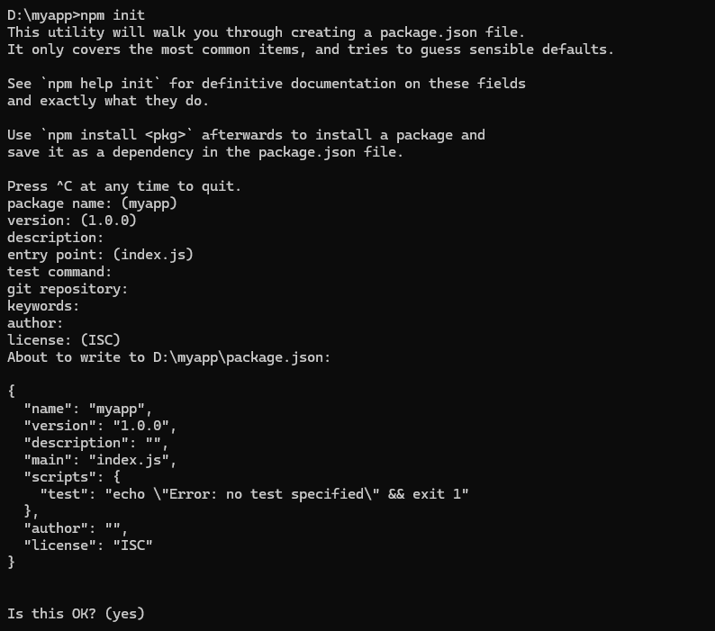

---

### 🔹 2. `npm install create-react-app`
👉 Installs **Create React App** tool.  
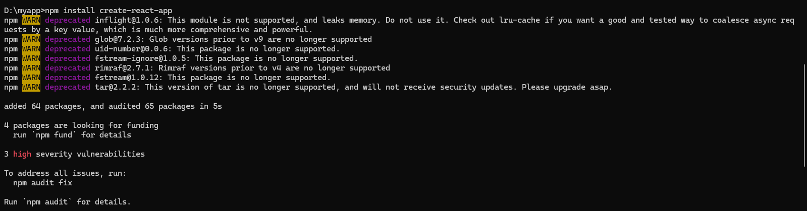

---

### 🔹 3. npx create-react-app myapp ✅

👉 Best & modern way to start a React app.
🖥️ Directly creates project folder myapp with ready setup.
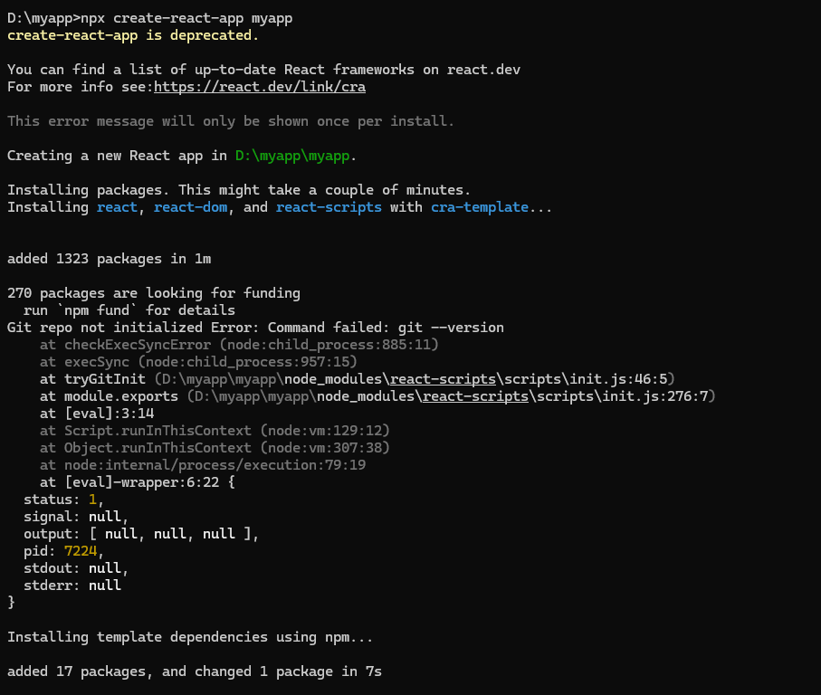
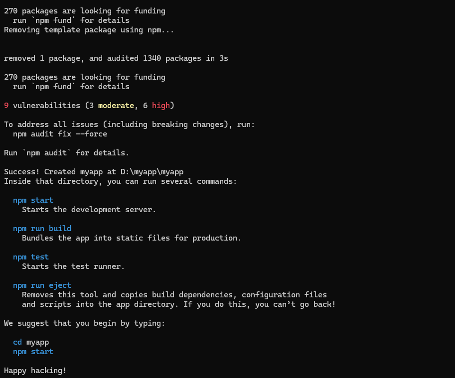

---

⚡ Steps:

npx create-react-app myapp  
cd myapp  
npm start  

✨ Browser opens → Your first React app runs! 🎉

---
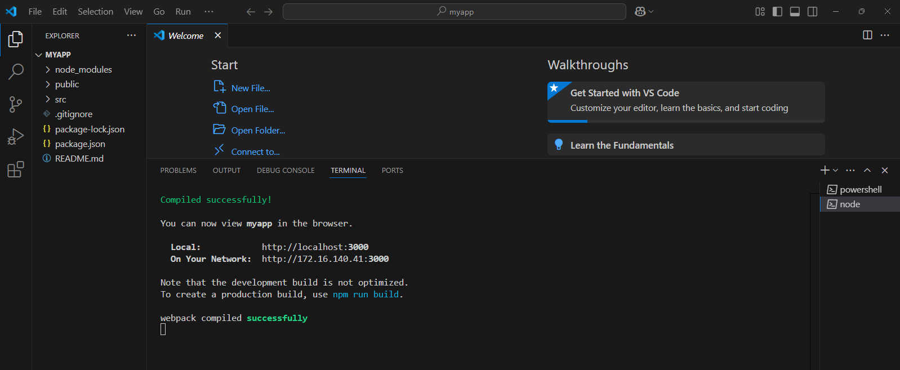

---
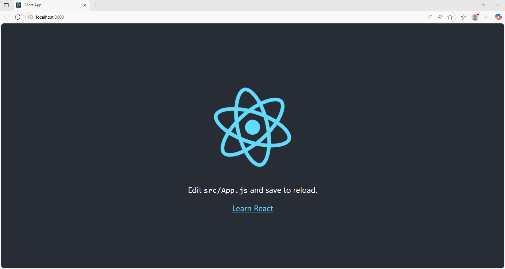

---
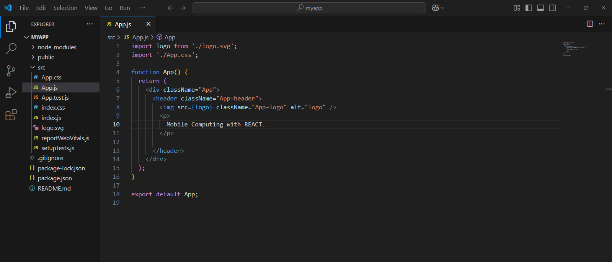

---
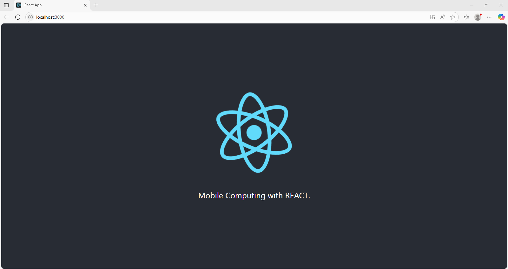

---

---
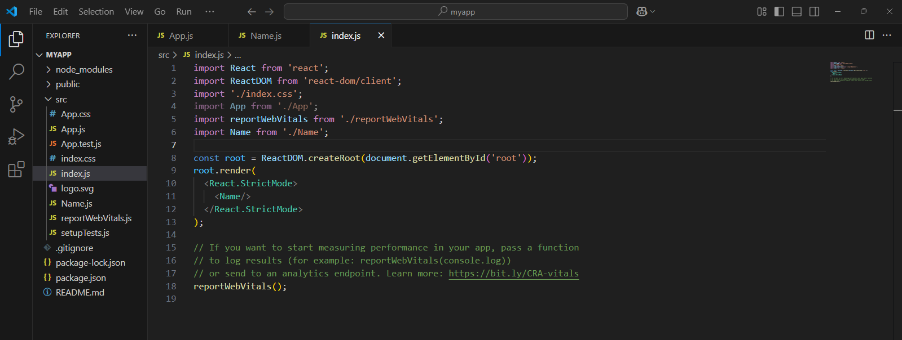

---
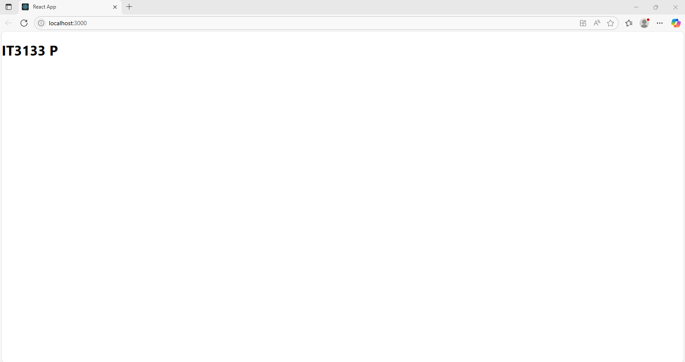

---
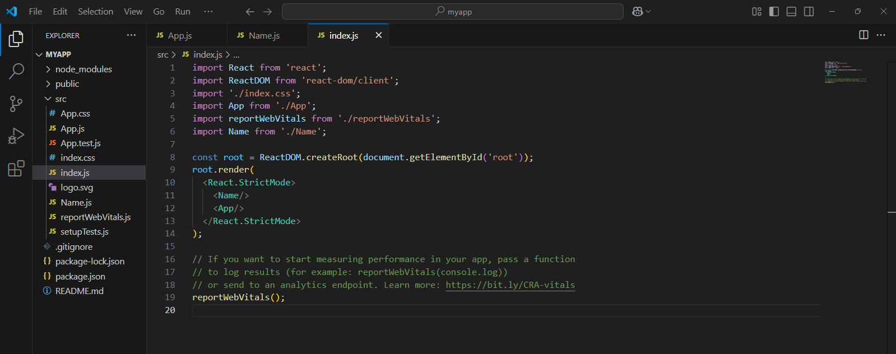

---
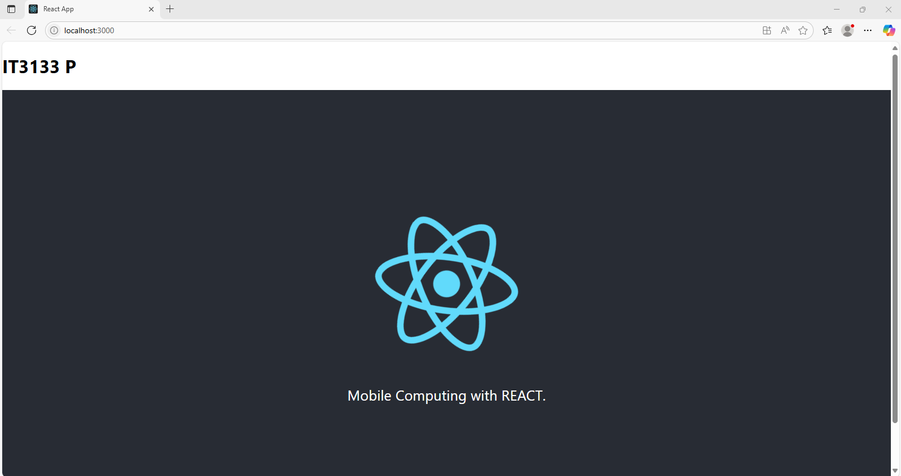

---

