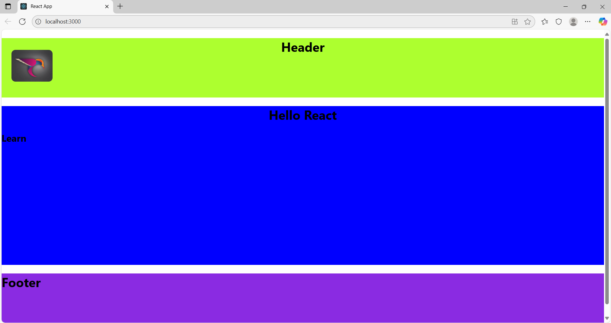

# 🌟 React Components & Props

## 📌 What are Components?

- Components are the **building blocks** of a React application.  
- Each component is a **reusable piece of UI** (like header, footer, logo, etc.).  
- Two main types:  
  - **Class Components** (older, use `class`)  
  - **Function Components** (modern, simpler, use `function` or arrow functions).  

### 📝 Example (Function Component)  
```js
function Header() {
  return <h1>Welcome to React 🚀</h1>;
}
});
```
## 📌 What are Props?

- **Props (Properties)** are used to pass data from **parent → child** components.  
- They make components **dynamic and reusable**.  
- Props are **read-only** (cannot be modified inside the child).  


📝 Example
```js
Copy code
function Body(props) {
  return (
    <div>
      <h2>{props.title}</h2>
      <p>{props.content}</p>
    </div>
  );
}
});
```
🔗 Usage
```js
Copy code
<Body title="Learn" content="Hello React" />
  ```
📌 Putting It All Together
```js
Copy code
root.render(
  <React.StrictMode>
    <Logo />
    <Header />
    <Body content="Hello React" title="Learn" />
    <Footer year="2024" />
  </React.StrictMode>
);
});
```
✔ Logo, Header, Body, Footer → Separate components.
✔ Props Example:

### 📌 Props Example

- `Body` receives:  
  - **title** = `"Learn"`  
  - **content** = `"Hello React"`  

- `Footer` receives:  
  - **year** = `"2024"`  


📌 Footer Component Example
```js
Copy code
export default function Footer(props) {
  return (
    <div className="footerbg">
      <h1>Footer - {props.year}</h1>
    </div>
  );
}
});
```
✔ Renders: Footer – 2024
✔ props.year makes it dynamic.

✅ Key Takeaways
⚛️ Components = Reusable UI blocks.

📦 Props = Data passed to components.

🔒 Props are immutable (child cannot change them).

🛠 Makes React apps scalable, modular, and easy to maintain.

✨ With Components + Props, you can build flexible, reusable, and powerful UIs in React! 🚀


---
